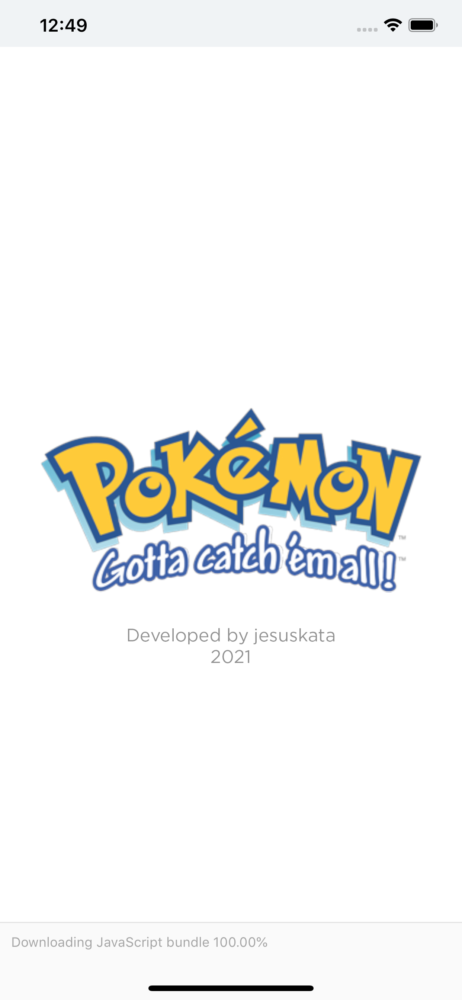
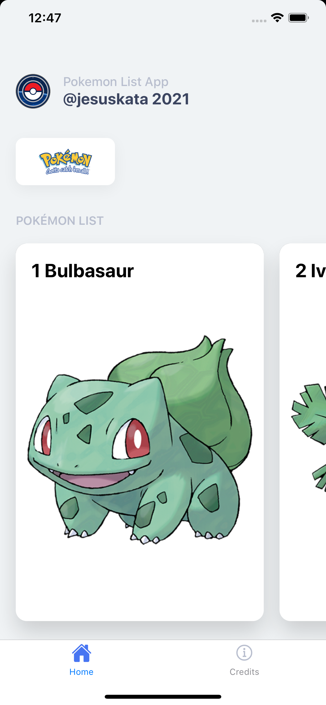
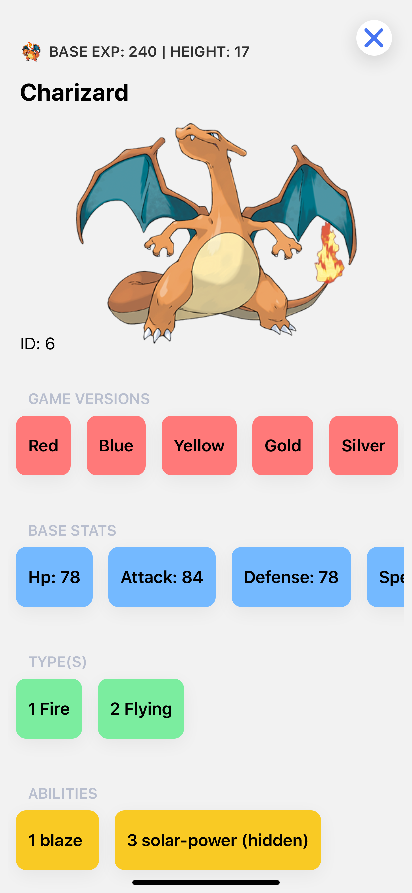
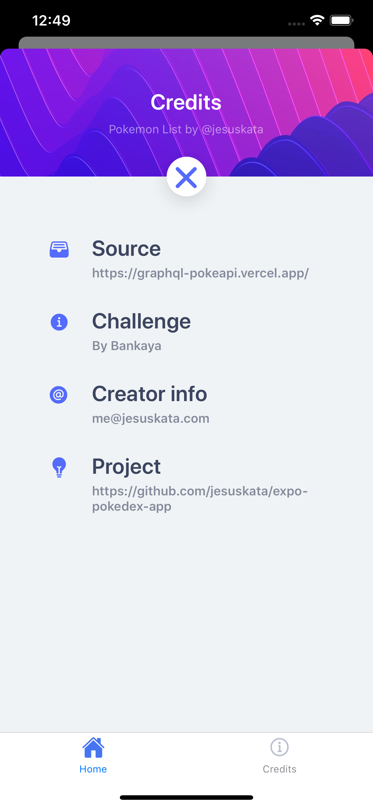

# Expo Pokédex App

This is a personal project developed with Expo for a mobile Pokedex App using [GraphQL PokeAPI](https://graphql-pokeapi.vercel.app/).

- [Expo Pokédex App](#expo-pokédex-app)
  - [Screenshots](#screenshots)
  - [Configurations for the project](#configurations-for-the-project)
  - [Running the project](#running-the-project)

## Screenshots

Splash screen


Home


Detail screen


Credits menu screen


## Configurations for the project

This project is written in React Native with Expo, so, the initial configurations are:

+ Yarn (the version of Yarn used is 1.22.10)
+ VSCode
+ ESLint
+ Commitizen
+ Node with NVM (the version of Node used is v14.15.1)
+ Expo (the version of Expo used is 4.1.6)

## Running the project

First of all, install all the dependencies:

```bash
yarn
```

Now, to run the project:

```bash
yarn start
```
